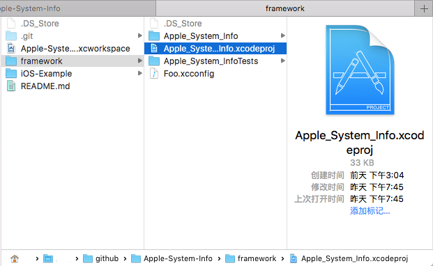

# Apple-System-Info(Swift)

Readme content will be expressed in both English and Chinese.

内容将会用英语和中文进行表述.

=========
a Swift implement for getting Apple System Infomation include :

* Device(Hardware/Defaults)
* Network
* Bundle
* Authorized

用Swift实现的获取各种系统信息 的轮子：

* 硬件
* 网络
* Bundle
* 权限

## Advantage of pure Swift implement

in a word 'Swifty'.

可以这很Swift。

## Usage

### DeviceInfo.swift

>model:设备型号
>
>OSVersion:系统版本
>
>name:设备名称
>
>isJailbreak: 是否越狱
>
>IDFA:广告标示符
>
>IDFV:Vendor标示符
>
>RAM:内存
>
>Disk:储存
>
>CPU:中央处理器
>

### NetworkInfo.swift

>status:网络连接状态:
>
> * NotReachable
> * ReachableViaWiFi
> * ReachableViaWWAN
>
>carrier:运营商
>
>IP Address
>
>usage : 数据使用量
>
> * .total_MB : 全部 使用量
> * .WiFi_MB : Wi-Fi 使用量
> * .WWAN_MB : 蜂窝数据 使用量
>
> (able to get current data(byte) per second via set a time interval, will get different value then subtraction them to make it out. 由此可以得出实时的数据传输速度，设置间隔时间获取使用量x1,x2 相减可得出 delta x)

### BundleInfo.swift

###### Elementary - 基本信息
>version:这个会设置应用程序版本号，每次部署应用程序的一个新版本时，将会增加这个编号，在app store用的
>
>shortVersion:指定了束的版本号。一般包含该束的主、次版本号。这个字符串的格式通常是“n.n.n”（n表示某个数字）。第一个数字是束的主要版本号，另两个是次要版本号。该关键字的值会被显示在Cocoa应用程序的关于对话框中
>
>infoDictionaryVersion:指定了属性列表结构的当前版本号。该关键字的存在使得可以支持Info.plist格式将来的版本。在您建立一个束时，Project Builder会自动产生该关键字
>
>build:
>
>name : 简称。简称应该小于16个字符并且适合在菜单和“关于”中显示。通过把它加入到适当的.lproj子文件夹下的InfoPlist.strings文件中，该关键字可以被本地化。如果您本地化了该关键字，那您也应该提供一个CFBundleDisplayName关键字的本地化版本
>
>type : 关键字指定了束的类型，类似于Mac OS 9的文件类型代码。该关键字的值包含一个四个字母长的代码。应用程序的代码是‘APPL’；框架的代码是‘FMWK’；可装载束的代码是‘BND’。如果您需要，您也可以为可装载束选择其他特殊的类型代码
>
>Signature : 指定了束的创建者，类似于Mac OS 9中的文件创建者代码。该关键字的值包含四字母长的代码，用来确定每一个束
>
>DisplayName : 这用于设置应用程序的名称，它显示在iphone屏幕的图标下方。应用程序名称限制在10－12个字符，如果超出，iphone将缩写名称
>
>Identifier : 身份证书，这个为应用程序在iphone developer program portal web站点上设置的唯一标识符。（就是你安装证书的时候，需要把这里对应修改）。例如com.apple.myapp。该束标识符可以在运行时定位束。预置系统使用这个字符串来唯一地标识每个应用程序
>
>DevelopmentRegion:
>
>Localizations:多语言。应用程序本地化的一列表，期间用逗号隔开，例如应用程序支持英语 日语，将会适用 English,Japanese.
>
>AllowMixedLocalizations
>
>categoryType:包含UTI相应的应用程序的类型。 App Store中使用该字符串的应用程序，以确定适当的分类
>
>externalFontsPath :如果想使用外部字体时，可以指定外问字体的资源文件
>
>hasLocalizedDisplayName :本地化显示名。设置为YES激活
>
>Copyright : 包含了一个含有束的版权信息的字符串。您可以在“关于”对话框中显示它。该关键字通常会出现在InfoPlist.strings文件中，因为往往需要本地化该关键字的值
>
>CoreData_store_type : 核心数据存储的文档类型
>
>NSDockTilePlugIn : 停靠插件路径
>
>GetInfoString : CFBundleGetInfoString关键字含有会在束的信息窗口中显示的纯文本字符串（这里的字符串也就是Mac OS 9中的长字符串）。该关键字的格式应该遵照Mac OS 9中的长字符串，例如：“2.2.1, ? Great Software, Inc, 1999”。通过把它加入到合适的.lproj目录中的InfoPlist.strings文件中，您也可以本地化该字符串。如果存在CFBundleGetInfoHTML的话，系统不会选择使用该关键字
>
>PreferenceSync_ExcludeSyncKeys
>
>NSPrincipalClass :定义了一个束的主类的名称。对于应用程序来说，缺省情况下这个名字就是应用程序的名字
>
>UISupportedExternalAccessoryProtocols : 指定应用程序与外界硬件配件间支持的通迅协议，這個键值是一组设定，可以指定多个通迅协议
>
>UIUpgradeOtherBundleIdentifier 
>
>isFileQuarantineEnabled
>
>UIAppFonts

###### Advance Graphic Default - 高级图像属性

>UIViewEdgeAntialiasing : 用于指示在描画不和像素边界对齐的层时，Core Animation层是否进行抗锯齿处理。这个特性使开发者可以在仿真器上进行更为复杂的渲染，但是对性能会有显著的影响。如果属性列表上没有这个键，则其缺省值为NO。这个键只在iPhone OS 3.0和更高版本上支持。如果信息属性文件中的属性值是显示在用户界面上的字符串，则应该进行本地化，特别是当Info.plist中的字符串值是与本地化语言子目录下InfoPlist.strings文件中的字符串相关联的键时。更多信息请参见“国际化您的应用程序”部分
>
>UIViewGroupOpacity : 用于指示Core Animation子层是否继承其超层的不透明特性。这个特性使开发者可以在仿真器上进行更为复杂的渲染，但是对性能会有显著的影响。如果属性列表上没有这个键，则其缺省值为NO。这个键只在iPhone OS 3.0和更高版本上支持
>
>UIStatusBarHidden : 设置是否隐藏状态栏。YES时隐藏，FALSE时不隐藏

###### Bundle Runtime Default - 运行时

>supportsSuddenTermination :指定应用程序是否可以被杀死
>
>exitsOnSuspend:是否支持在后台运行，YES时，点击HOME键，则退出应用。NO时点击HOME键切到后台
>
>isAgent :如果该关键字被设为“1”，启动服务会将该应用程序作为一个用户界面组件来运行。用户界面组件不会出现在Dock或强制退出窗口中。虽然它们通常作为后台应用程序运行，但是如果希望的话，它们也可以在前台显示一个用户界面。点击属于用户界面组件的窗口，应用程序将会处理产生的事件。Dock和登录窗口是两个用户界面组件应用程序
>
>isBackgroundOnly :如果该关键字存在并且被设为“1”，启动服务将只会运行在后台。您可以使用该关键字来创建无用户界面的后台应用程序。如果您的应用程序使用了连接到窗口服务器的高级框架，但并不需要显示出来，您也应该使用该关键字。后台应用程序必须被编译成Mach-O可执行文件。该选项不适用于CFM应用程序。您也可以指定该关键字的类型为Boolean或Number。然而，只有Mac OS X 10.2或以上的版本才支持这些类型的值
>
>UIBackgroundModes :后台执行模式
>
>isVisibleInClassic :指定代理的应用程序或后台唯一的应用程序在Classic环境中的其他应用程序是否是可见的
>
>isPrefersCarbon :如果该关键字被设为“1”，Finder将会在显示简介面板中显示“在Classic环境中打开”控制选项，缺省情况下该控件未被选中。如果需要，用户可以修改这个控制选项来在Classic环境中启动应用程序。您也可以指定该关键字的类型为Boolean或Number。然而，只有Mac OS X 10.2或以上的版本才支持这些类型的值。如果您在您的属性列表中加入了该关键字，那么就不要同时加入LSPrefersClassic, LSRequiresCarbon,或LSRequiresClassic关键字
>
>isRequiresCarbon :如果该关键字被设为“1”，启动服务将只在Carbon环境中运行应用程序。如果您的应用程序不应该运行在Classic环境中的话，可以使用该关键字。您也可以指定该关键字的类型为Boolean或Number。然而，只有Mac OS X 10.2或以上的版本才支持这些类型的值。如果您在您的属性列表中加入了该关键字，那么就不要同时加入LSPrefersCarbon, LSPrefersClassic,或LSRequiresClassic关键字
>
>isPrefersClassic :如果该关键字被设为“1”，Finder将会在显示简介面板中显示“在Classic环境中打开” 控制选项，缺省情况下该控件被选中。如果需要，用户可以修改这个控制选项来在Carbon环境中启动应用程序。您也可以指定该关键字的类型为Boolean或Number。然而，只有Mac OS X 10.2或以上的版本才支持这些类型的值。如果您在您的属性列表中加入了该关键字，那么就不要同时加入LSPrefersCarbon, LSRequiresCarbon,或LSRequiresClassic关键字
>
>isRequiresClassic :如果该关键字被设为“1”，启动服务将只在Classic环境中运行应用程序。如果您的应用程序不应该运行在Carbon兼容环境中的话，可以使用该关键字。您也可以指定该关键字的类型为Boolean或Number。然而，只有Mac OS X 10.2或以上的版本才支持这些类型的值。如果您在您的属性列表中加入了该关键字，那么就不要同时加入LSPrefersCarbon, LSPrefersClassic,或LSRequiresCarbon关键字
>
>isUINewsstandApp :是否允许应用程序在Newsstand中显示。如果设为YES。可以通过设置NewsstandIcon来美化图标
>
>isMultipleInstancesProhibited :指定一个或多个用户是否可以同时启动一个应用程序
>
>isGetAppDiedEvents : 指定是否一个子进程死亡时通知应用程序。如果你的值设置为YES这个关键，系统会发送您的应用程序kAEApplicationDied苹果事件
>
>UIPresentationMode : 应用程序启动时设置系统UI元素的可见性。确定了初始的应用程序的用户界面模式。你可以使用这个应用程序，可能需要采取部分包含UI元素，如在Dock和菜单栏的屏幕。大多数模式的影响只出现在内容区域中的画面，就是在屏幕的面积，不包括菜单栏的UI元素。但是，您可以要求所有的UI元素被隐藏
>
>SMAuthorizedClients : 允行添加或移除工具。具体还真不知道什么效果。没试出来
>
>CSResourcesFileMapped : 是否进行文件映射。指定是否将应用程序的资源映射文件到内存中。否则，他们通常读入内存。对于经常访问的资源数量，使用文件映射可以提高性能。然而，资源被映射到只读存储器，不能被修改
>
>NSAppleScriptEnabled : 说明了该应用程序是否支持AppleScript。如果您的应用程序支持，就需要把该字符串的值设为“Yes”
>
>OSAScriptingDefinition :  脚本文件名
>
>NSServices : 包含了一组字典，它详细说明了应用程序所提供的服务
>
>ArchitecturePriority : 用于标识此应用程序支持的体系结构。此阵列中的字符串的顺序决定优选的执行优先级的架构
>
>ExecutableArchitectures : 用于标识此应用程序支持的体系结构
>
>EnvironmentVars : 用于标识此应用程序支持的体系结构
>
>Executable : 应用程序的可执行文件。对于一个可加载束,它是一个可以被束动态加载的二进制文件。对于一个框架，它是一个共享库。Project Builder会自动把该关键字加入到合适项目的Info.plist文件中

###### Requirement - 系统需求

>isRequiresIPhoneOS : 如果应用程序不能在ipod touch上运行，设置此项为true
>
>isRequiresNativeExecution : 指定应用程序是否必须在本机运行一个基于Intel的Mac上，而不是根据Rosetta模拟。指定是否要启动该应用程序使用subbinary当前的架构。如果此键被设置为“YES”，启动服务始终运行应用程序使用当前的架构编译的二进制代码。您可以使用此键，以防止一个通用的二进制下运行的Rosetta模拟一个基于Intel的Mac上
>
> MinimumSystemVersion : 最小系统版本
>
>UIRequiredDeviceCapabilities : 当提交程序到app store时，3.0及更高版本的应用程序不再直接说明使用哪种设备，而是使用info.plist文件来确定需要哪些设备功能。iTunes通过这个所需功能的列表来确定一个应用程序能否下载到一个指定的设备并在该设备上正常运行。例如，我在info.plist中设置如下，那么只有居右wifi、电话功能和麦克风（内置的或附件所带的麦克风功能）的ios设备才能运行该程序
>
>isRequiresPersistentWiFi : 如果应用程序需要wi-fi才能工作，应该将此属性设置为true。这么做会提示用户，如果没有打开wi-fi的话，打开wi-fi。为了节省电力，iphone会在30分钟后自动关闭应用程序中的任何wi-fi。设置这一个属性可以防止这种情况的发生，并且保持连接处于活动状态

###### Installer - 安装时的推荐设置

>SMPrivilegedExecutables :辅助工具，辅助工具必须有一个嵌入式的Info.plist中包含的“SMAuthorizedClients”的字符串数组。每个字符串是一个文本表示的代码签名要求描述一个客户端，它允许添加和删除工具
>
>APInstallerURL :指定了一个指向您希望安装的文件的路径。您必须以file://localhost/path/ 形式来说明这个路径。所有被安装的文件必须位于这个文件夹中。
>
>Installation files : APFiles
>
> * FileDescriptionKey : 用来显示在Finder的信息窗口中的简短描述
> * DisplayedAsContainer : 如果值为“Yes”，该项目作为一个目录图标显示在信息面板中；否则，它被显示为一个文档图标
> * FileDestinationPath : 一个安装组件的相对路径
> * FileName : 文件或目录的名称
> * FileSourcePath : 指向应用程序包中组件的路径，相对与APInstallerURL路径
> * InstallAction : 操纵组件的动作：“Copy”或者“Open”

###### Default Resources - 访问默认资源的扩展

>UIPrerenderedIcon : 默认情况下，应用程序被设置了玻璃效果，把这个设置为true可以阻止这么做
>
>IconFile :设置应用程序图标的。CFBundleIconFile关键字指定了包含该束图标的文件。您给出的文件名不需要包含“.icns”扩展名。Finder会在该束的“Resource”文件夹内寻找图标文件。如果您的束使用了自定义的图标，那您就必须指定该属性。假如您没有指定，Finder（和其他应用程序）会使用缺省的图标来显示您的束
>
>LaunchImageFile :启动图像。根据不同设备来设置图片的规格大小
>
> * default
> * ipad
> * iphone
>
>NSMainNibFile :包含了一个含有应用程序的主nib文件名（不包含.nib文件扩展名）的字符串。一个nib文件作为一个Interface Builder的存档文件，含有对用户界面的详细描述信息以及那些界面中的对象之间的关联信息。当应用程序被启动时，主nib文件会被自动装载。Mac OS X会寻找与应用程序名相匹配的nib文件
>
> * default
> * ipad
> * iphone
>
>UIMainStoryboardFile :故事板文件名
>
> * default
> * ipad
> * iphone
>
>UISupportedInterfaceOrientations :设定应用程序的显示模式
>
> * default
> * ipad
> * iphone
>
>NSPrefPaneIconFile
>
>NSPrefPaneIconLabel
>
>HelpBookFolder : 帮助目录，CFBundleHelpBookFolder关键字含有该束的帮助文件的文件夹名字。帮助通常被本地化成一种指定的语言，所以该关键字指向的文件夹应该是所选择语言的.lproj目录中的文件夹
>
>HelpBookName :
>
>HelpAnchor :定义了束的初始HTML帮助文件名，不需要包括.html或.htm扩展名。这个文件位于束的本地化资源目录中，或者如果没有本地化资源目录的话，则直接被放在Resources目录中

###### UTI & document - 文件 & UTI扩展

>FileSharingEnabled : 应用程序支持共享到iTunes   值为 boolean 值   YES 共享；  NO 不共享
>
>URLTypes : 包含了一组描述了应用程序所支持的URL协议的字典。它的用途类似于CFBundleDocumentTypes的作用，但它描述了URL协议而不是文档类型。每一个字典条目对应一个单独的URL协议
>
>DocumentTypes : 保存了一组字典，它包含了该应用程序所支持的文档类型。每一个字典都被称做类型定义字典，并且包含了用于定义文档类型的关键字。表A-2列出了类型定义字典中支持的关键字
>
>UTExportedTypeDeclarations : 导出UTI（Unique Type Identifier）类型
>
>UTExportedTypeDeclarations : 导出UTI（Unique Type Identifier）类型

###### Java - Java扩展

>isJavaNeeded : 用来确定在执行该束的代码之前Java虚拟机是否需要被载入并运行
>
>NSJavaPath : 包含了一组路径。每一个路径指向一个Java类。该路径相对于由NSJavaRoot关键字定义的位置来说，可能是一个绝对路径也可能是一个相对路径。开发环境会自动把这些值保存在数组中
>
>NSJavaRoot : 一个指向一个目录的字符串。该目录是应用程序的Java类文件的根目录

###### PlugIn - 插件扩展

>PlugInDynamicRegisterFunction
>
>PlugInFactories : 插件工厂接口
>
>PlugInDynamicRegistration : 是否动态注册插件
>
>PlugInTypes : 插件类型
>
>PlugInUnloadFunction : 插件卸载函数名

###### Quick Look - 快速查看扩展

>QLNeedsToBeRunInMainThread
>
>QLPreviewHeight
>
>QLPreviewWidth
>
>QLSupportsConcurrentRequests
>
>QLThumbnailMinimumSize
>
>
>
>
>
>
>
>
>
>
>
>
>
>
>

### AuthorizedInfo.swift

>isLocationAuthorized:地理位置是否可用
>
>
>
>
>

## Install

Just Drag *#framework/Apple_System_Info.xcodeproj#* to your project or xcworkspace

把 *Apple_System_Info.xcodeproj* 拖进 项目或者工作台 去就行了

## Contact
if you have any question,contact me.

有问题找大哥

email: [xxvk@outlook.com](mailto:xxvk@outlook.com)

wechat: phrekn

github: [xxvk](https://github.com/xxvk)

website: [reformation.tech](http://reformation.tech)